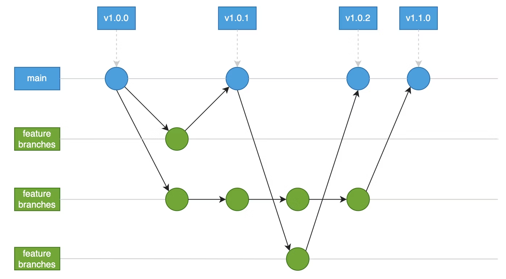

# Contribution Guidelines

These guidelines define a unified commit style for development.

- [Contribution Guidelines](#contribution-guidelines)
  - [Branching Strategy](#branching-strategy)
  - [Creating a Feature Branch](#creating-a-feature-branch)
  - [Creating a Pull Request](#creating-a-pull-request)
  - [Reviewing a Pull Request](#reviewing-a-pull-request)
  - [Merge](#merge)

## Branching Strategy

We use a **GitHub Flow** branching strategy with the following branches:



- **main**: Stable, production-ready code. Create a version tag at the time of release.
- **feature branches**: Individual branches for new features or fixes, named `feat/<description>`. Delete after merging.

## Creating a Feature Branch

1. Get the latest changes from `main`:

    ```bash
    git fetch -p
    git checkout main
    git pull origin main
    ```

2. Create a new branch from `main`:

    ```bash
    git checkout -b feat/<description>
    ```

3. Make your changes and commit them:

    ```bash
    git add .
    git commit -m "<description of changes>"
    ```

4. Ensure your branch is up to date with `main`:

    ```bash
    git fetch -p
    git rebase origin/main
    ```

5. Push your branch to the remote repository:

    ```bash
    git push origin feat/<description>
    ```

## Creating a Pull Request

1. Open a PR from [New pull request](https://github.com/Pontosense/annot-portal/compare)
2. Select `base: main` and `compare: feat/<description>`.
3. Click `Create pull request`.
4. Give a clear, descriptive title and follow the `.github/pull_request_template.md` template.
5. Select the appropriate person or Copilot as a reviewer.
6. Select yourself as an assignee.
7. Select the appropriate labels (e.g., `enhancement`, `bug`, etc.).
8. Click `Create pull request`.
9. Add explanatory comments in `Files changed` tab if necessary.

## Reviewing a Pull Request

1. Review the code changes in the `Files changed` tab.
2. Check for:
   - Code quality and readability. (e.g., meaningful variable names, clear logic).
   - Adherence to coding standards. (e.g., black, isort, flake8)
   - Functionality and correctness of the changes. (e.g., does it solve the issue?)
   - Proper documentation and comments. (e.g., docstrings, inline comments)
   - No breaking changes or regressions. (e.g., does it introduce new bugs?)
3. If you have questions or suggestions:
   - Use the comment feature to ask questions or suggest improvements.
   - Use the `+` button next to the line number to add comments.
   - Use labels to categorize comments (see table below).
4. If you approve the changes:
   - Click `Review changes` and select `Approval`.
   - Put an [LGTM](https://looks-to.me/) and list the good points in the comment section.
5. If you reject the changes:
   - Click `Review changes` and select `Request changes`.

| Label | Meaning          | Purpose / Intent                                         |
|-------|------------------|----------------------------------------------------------|
| Q     | Question         | Needs an answer.                                         |
| FYI   | For your info    | Reference only; no action.                               |
| NITS  | Nitpicks         | Trivial suggestion; may be ignored.                      |
| IMO   | In my opinion    | Minor proposal; consider tasking/fixing.                 |
| NR    | No rush          | Address eventually; consider tasking/fixing.             |
| REC   | Recommend        | Should fix soon; not mandatory; consider tasking.        |
| MUST  | Must             | Blocking issue; fix before approval (critical bug, etc.) |

## Merge

1. Ensure the pull request is approved by at least one reviewer.
2. Ensure all checks (e.g., CI/CD, tests) pass.
3. Merge the pull request using `Create a merge commit` (same as `git merge --no-ff <branch>`).
4. After merging, delete the feature branch:
   - If you are using GitHub, you can click the "Delete branch" button after merging.
   - If you are using the command line, run:

        ```bash
        git branch -d feat/<description>
        git push origin --delete feat/<description>
        ```
